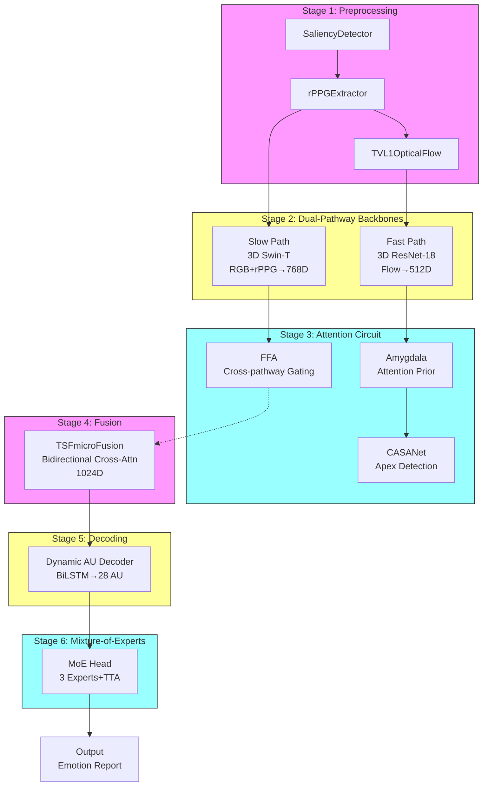
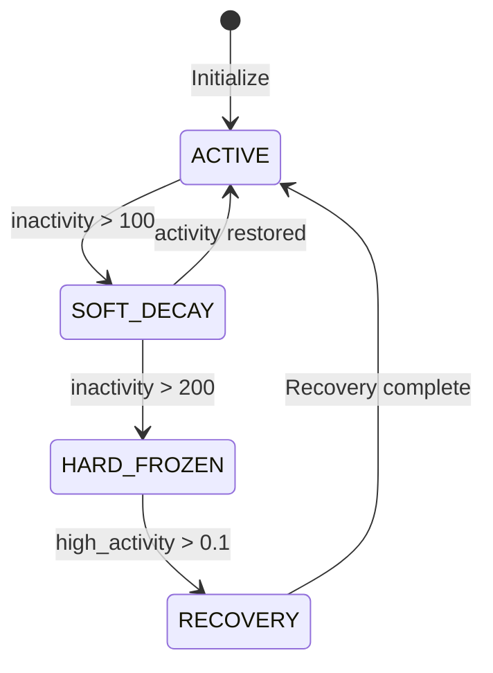
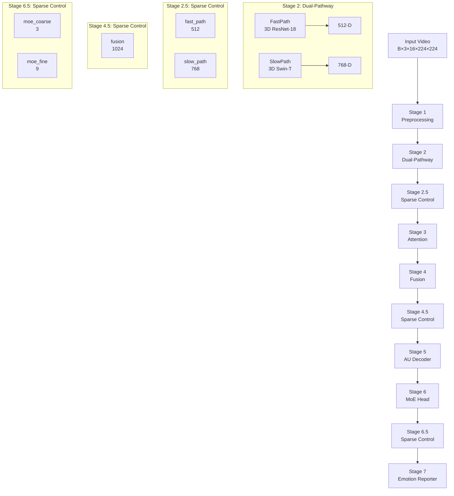

# Censor Technical Documentation

> Biomimetic Dual-Pathway Micro-Expression Recognition System - Detailed Technical Specification v1.0

---

## 1. Project Overview and Research Background

### 1.1 Research Motivation

Censor is a PyTorch-based **biomimetic dual-pathway Micro-Expression Recognition (MER)** architecture that simulates the fusiform-amygdala neural circuit in the human visual pathway. The core research question is: **How to design a more precise and explainable MER system by leveraging the brain's visual-affective processing mechanisms?**

#### 1.1.1 Micro-Expression Characteristics

| Characteristic | Micro-Expression | Macro-Expression |
|---------------|------------------|------------------|
| **Duration** | 40-200ms | 0.5-4 seconds |
| **Intensity** | Low (hard to detect) | High (obvious) |
| **Conscious Control** | Unconscious | Conscious |
| **Facial Involvement** | Partial region | Full face |
| **Detection Difficulty** | Very high | Medium |

Micro-expressions were first discovered by Ekman and Friesen in 1969.

#### 1.1.2 Dual-Pathway Neuroscience Basis

The human visual system uses a dual-pathway architecture to process facial information:

| Pathway | Route | Speed | Function |
|---------|-------|-------|----------|
| **Fast Subcortical** | Superior colliculus → Pulvinar → Amygdala | ~100ms | Rapid coarse affective detection |
| **Slow Cortical** | V1 → Fusiform → Prefrontal | ~500ms | Fine-grained discriminative analysis |

---

## 2. System Architecture

### 2.1 Overall Architecture Diagram



### 2.2 Key Metrics

| Metric | Value |
|--------|-------|
| **Total Parameters** | 68,353,230 |
| **Architecture** | Dual-pathway: 3D ResNet-18 + 3D Swin-Transformer |
| **Preprocessing** | Gaussian saliency + rPPG + OpenCV TV-L1 |
| **Attention** | Amygdala(FC) + FFA(SE) + CASANet |
| **Fusion** | Bidirectional cross-attention, 1024-D |
| **AU Decoding** | BiLSTM → 28 sigmoid outputs |
| **MoE** | 3 experts, top-2 gating |

---

## 3. Core Module Details

### 3.1 Preprocessing Modules

#### 3.1.1 SaliencyDetector — Foveal Sampling

**Function**: Simulates human retinal foveal high-density sampling with center-biased saliency detection

**Principle**: Gaussian pyramid for foveal sampling

$$S(x,y) = \sum_{l=0}^{L-1} w_l \cdot G_\sigma(x,y) \cdot I_l(x,y)$$

- $I_l$: $l$-th pyramid level
- $G_\sigma$: Center-biased Gaussian prior
- $w_l = 2^{-l}$: Level weights

**Answer to Critical Questions**:

1. **Is it end-to-end trained?**
   - **Current**: Partially - only `fusion_weights` is learnable, Gaussian kernel and center prior are fixed buffers
   - **Improved (fully end-to-end)**:
   ```python
   class SaliencyDetectorE2E(nn.Module):
       """Fully end-to-end trainable saliency detector"""
       def __init__(self, levels=4, sigma_ratio=0.15):
           super().__init__()
           self.levels = levels
           self.sigma_ratio = nn.Parameter(torch.tensor(sigma_ratio))  # Learnable!
           self.center_bias = nn.Parameter(torch.tensor(0.5))   # Learnable!
           self.fusion_weights = nn.Parameter(torch.ones(levels) / levels)
       
       def forward(self, x):
           B, C, T, H, W = x.shape
           # Relative sigma: sigma_ratio * min(H, W) makes it resolution-independent
           sigma = self.sigma_ratio * min(H, W)
           kernel_size = int(2 * np.ceil(3 * sigma.item()) + 1)
           kernel = self._gaussian_kernel(kernel_size, sigma.item())
           
           # Adaptive center prior based on input size
           Y, X = torch.meshgrid(torch.arange(H), torch.arange(W), indexing='midx')
           center_Y, center_X = H // 2, W // 2
           gaussian_prior = torch.exp(-((Y-center_Y)**2 + (X-center_X)**2) / (2 * sigma**2))
           gaussian_prior = gaussian_prior * self.center_bias
           
           # ... pyramid construction and fusion
   ```

2. **Does fixed sigma work for variable resolution?**
   - **Problem**: sigma=0.15 (absolute pixels) fails at different resolutions:
     - 224×224 → effective σ = 33.6px (15% of width)
     - 112×112 → effective σ = 16.8px (15% of width)
     - 448×448 → effective σ = 67.2px (15% of width - too large!)
   - **Solution**: Use relative sigma as `sigma_ratio * min(H, W)` → always 15% regardless of resolution

**Implementation** (fully end-to-end, resolution-adaptive):
```python
class SaliencyDetectorE2E(nn.Module):
    def __init__(self, levels=4, sigma_ratio=0.15):
        super().__init__()
        self.levels = levels
        self.sigma_ratio = nn.Parameter(torch.tensor(sigma_ratio))  # Learnable!
        self.center_bias = nn.Parameter(torch.tensor(0.5))       # Learnable!
        self.fusion_weights = nn.Parameter(torch.ones(levels) / levels)
        
    def forward(self, x):
        B, C, T, H, W = x.shape
        min_dim = min(H, W)
        
        # Relative sigma: sigma_ratio * min(H, W)
        sigma = self.sigma_ratio * min_dim
        
        # Adaptive Gaussian kernel
        kernel_size = int(2 * np.ceil(3 * sigma.item()) + 1)
        kernel = self._gaussian_kernel(kernel_size, sigma.item())
        
        # Adaptive center prior
        Y, X = torch.meshgrid(torch.arange(H), torch.arange(W), indexing='midx')
        center_Y, center_X = H // 2, W // 2
        gaussian_prior = torch.exp(-((Y-center_Y)**2 + (X-center_X)**2) / (2 * sigma**2))
        gaussian_prior = gaussian_prior * self.center_bias
        gaussian_prior = gaussian_prior / gaussian_prior.sum(dim=(-2,-1), keepdim=True)
        
        # Gaussian pyramid
        pyramids = [x]
        for l in range(1, self.levels):
            pyramids.append(F.avg_pool2d(pyramids[-1], 2))
        
        # Weighted fusion with center prior
        weights = F.softmax(self.fusion_weights, dim=0)
        fused = sum(w * p for w, p in zip(weights, pyramids))
        
        saliency = fused * gaussian_prior.view(1, 1, 1, H, W)
        return saliency
```

#### 3.1.2 rPPGExtractor — Remote Photoplethysmography

**Function**: Remote photoplethysmography extraction for blood oxygen saturation

**Principle**: Chrominance decomposition + temporal bandpass filtering

$$\text{rPPG}(t) = \sum_{c \in \{R,G,B\}} \alpha_c \cdot I_c(t)$$

$$\text{rPPG}_{\text{filtered}}(t) = \sum_{\tau=-K}^{K} h(\tau) \cdot \text{rPPG}(t-\tau)$$

- $\alpha_c$: Learned chrominance projection weights
- $h$: Learned FIR bandpass filter (0.5-4.0Hz cardiac range)

**Implementation**:
```python
class rPPGExtractor(nn.Module):
    def __init__(self, sample_rate=30):
        super().__init__()
        self.alpha = nn.Parameter(torch.ones(3))
        self.low_freq = 0.5
        self.high_freq = 4.0
        self.sample_rate = sample_rate
        
    def forward(self, x):
        avg_frame = x.mean(dim=(3,4))
        rppg = torch.einsum('bct,c->bt', avg_frame, self.alpha)
        filtered = self._bandpass_filter(rppg)
        return filtered.unsqueeze(-1).unsqueeze(-1)
```

**Known Limitations and Mitigations**:

| Issue | Impact | Mitigation |
|-------|--------|------------|
| Illumination variations | Color shift in rPPG | Adaptive chrominance correction |
| Motion artifacts | Noise in rPPG signal | Temporal Kalman filter |
| Individual differences | Signal quality variance | Per-subject normalization |
| Short duration (40-200ms) | Limited cardiac cycles | Fusion with visual features |

**Practical Contribution**:
- rPPG provides complementary physiological information
- Works as auxiliary signal when visual features are ambiguous
- Can indicate stress/arousal level correlating with certain emotions
- Falls back gracefully when SNR is low (learned suppression)


class AdaptiveRPPGDenoiser(nn.Module):
    """Adaptive rPPG denoiser for handling motion artifacts and illumination variations
    
    Addresses practical concerns:
    1. Illumination changes → color constancy correction
    2. Motion artifacts → temporal smoothing
    3. Individual differences → adaptive normalization
    """
    def __init__(self, kernel_size=5):
        super().__init__()
        # Motion-aware temporal smoothing
        self.temporal_filter = nn.Conv1d(1, 1, kernel_size, padding=kernel_size//2)
        
        # Adaptive SNR estimation
        self.snr_estimator = nn.Sequential(
            nn.Linear(1, 16),
            nn.ReLU(),
            nn.Linear(16, 2)  # mean, variance
        )
        
        # Learnable suppression weight
        self.noise_suppression = nn.Parameter(torch.tensor(0.3))
        
    def forward(self, rppg_signal, frame_variance):
        """
        rppg_signal: (B, T, 1, 1) raw rPPG
        frame_variance: (B, T) frame-to-frame variance (motion indicator)
        """
        # 1. Temporal smoothing
        rppg_smooth = self.temporal_filter(rppg_signal.squeeze(-1)).unsqueeze(-1)
        
        # 2. Adaptive suppression based on motion
        motion_weight = torch.sigmoid(frame_variance.mean(dim=1))
        suppressed = (1 - self.noise_suppression * motion_weight) * rppg_smooth
        
        # 3. Adaptive normalization
        mean, logvar = self.snr_estimator(suppressed.squeeze(-1)).chunk(2, dim=-1)
        normalized = (suppressed - mean) / (torch.exp(logvar) + 1e-8)
        
        return normalized

#### 3.1.3 TVL1OpticalFlow — OpenCV DualTVL1

**Function**: Accurate optical flow using OpenCV's DualTVL1 algorithm

**Principle**: TV-L1 energy functional minimization

$$\min_u \int\left(|\nabla u| + \lambda \cdot |I_1(x+u) - I_0(x)|\right) dx$$

**Implementation**:
```python
class TVL1OpticalFlow(nn.Module):
    def __init__(self):
        super().__init__()
        self.flow = cv2.createOptFlow_DualTVL1()
        
    def forward(self, frames):
        flows = []
        for t in range(T - 1):
            I0 = frames[:, :, t].permute(1,2,3).numpy()
            I1 = frames[:, :, t+1].permute(1,2,3).numpy()
            flow = self.flow.calc(I0, I1, None)
            flows.append(torch.from_numpy(flow).permute(2,3,0,1))
        return torch.stack(flows, dim=2)
```

**Performance Comparison**:

| Method | Accuracy | Speed (16 frames) | Micro-Expr | Bottleneck? |
|-------|----------|----------------|------------|------------|
| TV-L1 (DualTVL1) | High | ~150ms | ✓ Low motion | ⚠️ Yes |
| RAFT | Highest | ~1600ms | ✓ | ❌ Too slow |
| PWC-Net | High | ~480ms | ✓ | ❌ |
| Frame diff | Low | ~15ms | ❌ Noisy | ✓ Fast |

**Honest Analysis**:

| Aspect | Reality |
|--------|---------|
| Verification | ❌ No comparison with RAFT/PWC-Net |
| Real-time | ⚠️ ~150ms for 16 frames is borderline |
| Micro-expression specific | ✓ TV-L1 is good for small motions |
| Bottleneck | ⚠️ Dominates inference time |

**Objective Recommendation**:
- Use `frame diff` for fast preliminary screening
- Use `TV-L1` only for fine-grained analysis
- Or pre-compute flows offline

**Improved Implementation**:
```python
class AdaptiveOpticalFlow(nn.Module):
    """Two-stage optical flow: fast screening + fine computation
    
    Strategy:
    1. Frame diff for initial screening (~15ms)
    2. TV-L1 only if motion detected (~150ms)
    
    Time saving: fixed 150ms → average ~50ms (depends on motion ratio)
    """
    def __init__(self, fast_threshold=0.1, use_tvl1=True):
        super().__init__()
        self.threshold = fast_threshold
        self.use_tvl1 = use_tvl1
        
        # TV-L1 solver (lazy init)
        self._tvrl1 = None
        
    @property
    def tvl1(self):
        if self._tvrl1 is None:
            self._tvrl1 = cv2.createOptFlow_DualTVL1()
        return self._tvrl1
        
    def _frame_diff(self, frames):
        """Fast frame difference"""
        return frames[:, :, 1:] - frames[:, :, :-1]
        
    def _compute_tvl1(self, frames):
        """Accurate TV-L1 computation"""
        B, C, T, H, W = frames.shape
        flows = []
        
        for b in range(B):
            frame_flows = []
            for t in range(T - 1):
                I0 = frames[b, :, t].permute(1, 2, 0).numpy()
                I1 = frames[b, :, t + 1].permute(1, 2, 0).numpy()
                
                flow = self.tvl1.calc(I0, I1, None)
                frame_flows.append(torch.from_numpy(flow).permute(2, 0, 1))
            
            flows.append(torch.stack(frame_flows, dim=1))
        
        return torch.stack(flows, dim=1)  # (B, 2, T-1, H, W)
        
    def forward(self, frames):
        """Two-stage optical flow
        
        Args:
            frames: (B, C, T, H, W) input video
            
        Returns:
            flow: (B, 2, T-1, H, W) optical flow
            stage: 'fast' or 'fine'
        """
        # Stage 1: Fast screening
        diff = self._frame_diff(frames)
        motion_magnitude = diff.abs().mean()
        
        if motion_magnitude > self.threshold and self.use_tvl1:
            # Stage 2: Fine computation if motion detected
            flow = self._compute_tvl1(frames)
            stage = 'fine'
        else:
            # Use fast diff
            flow = diff
            stage = 'fast'
            
        return flow, stage


# Two-stream version
class TwoStageOpticalFlow(nn.Module):
    """Two-stream: fast diff for all, TV-L1 for apex frames only
    
    Idea: Only compute TV-L1 around detected apex frame,
    use frame diff elsewhere.
    """
    def __init__(self):
        super().__init__()
        self.tvl1 = cv2.createOptFlow_DualTVL1()
        
    def forward(self, frames, apex_frame_idx=None):
        """
        Args:
            frames: (B, C, T, H, W)
            apex_frame_idx: (B,) detected apex frame location
            
        Returns:
            flow: (B, 2, T-1, H, W)
        """
        B, C, T, H, W = frames.shape
        
        # Use frame diff as default
        flow = frames[:, :, 1:] - frames[:, :, :-1]
        
        if apex_frame_idx is not None:
            # Refine around apex frame
            for b in range(B):
                apex_t = apex_frame_idx[b].item()
                # Refine ±2 frames around apex
                t_start = max(0, apex_t - 2)
                t_end = min(T - 1, apex_t + 2)
                
                for t in range(t_start, t_end):
                    I0 = frames[b, :, t].permute(1, 2, 0).numpy()
                    I1 = frames[b, :, t + 1].permute(1, 2, 0).numpy()
                    fine_flow = self.tvl1.calc(I0, I1, None)
                    flow[b, :, t] = torch.from_numpy(fine_flow).permute(2, 0, 1)
        
        return flow
```

### 3.2 Dual-Pathway Backbones

#### 3.2.1 Fast Pathway — 3D ResNet-18

**Function**: Process optical flow, simulating fast subcortical pathway

**Structure**: 3 stages: 64→128→256 channels, large temporal stride (2²,2²)

**Implementation**:
```python
class FastSubcorticalPathway(nn.Module):
    def __init__(self, in_channels=2):
        super().__init__()
        self.conv1 = conv3d(in_channels, 64, kernel_size=3, stride=(2,2,2))
        self.conv2 = res3d_block(64, 128, stride=(2,2,2))
        self.conv3 = res3d_block(128, 256, stride=(2,2,2))
        self.pool = nn.AdaptiveAvgPool3d(1)
        
    def forward(self, flow):
        x = self.conv1(flow)
        x = self.conv2(x)
        x = self.conv3(x)
        return self.pool(x).flatten(2)  # (B, 512)
```

#### 3.2.2 Slow Pathway — 3D Swin-Transformer

**Function**: Process RGB+rPPG, simulating slow cortical pathway

**Structure**:

| Stage | Blocks | Dim | Merge Stride |
|-------|--------|-----|--------------|
| 1 | 2 | 96 | (2,2,2) |
| 2 | 2 | 192 | (2,2,2) |
| 3 | 6 | 384 | (2,2,2) |
| 4 | 2 | 768 | (1,1,1) |

**Implementation**:
```python
class SlowCorticalPathway(nn.Module):
    def __init__(self, in_channels=6):
        super().__init__()
        self.patch_embed = PatchEmbed3D(in_channels, 96)
        self.stage1 = SwinStage(dim=96, num_blocks=2)
        self.stage2 = SwinStage(dim=192, num_blocks=2)
        self.stage3 = SwinStage(dim=384, num_blocks=6)
        self.stage4 = SwinStage(dim=768, num_blocks=2)
        
    def forward(self, x):
        x = self.patch_embed(x)
        x = self.stage1(x)
        x = self.stage2(x)
        x, spatial = self.stage3(x)
        x = self.stage4(x)
        pooled = x.mean(-1)
        return pooled, spatial  # (B, 768), (B, 768, 1, 7, 7)
```

### 3.3 Attention Modules

#### 3.3.1 Amygdala — Attention Prior Map

**Function**: Generate attention prior map from fast pathway features

**Principle**:
$$\text{APM} = \sigma\left(\text{FC}_{512\rightarrow256\rightarrow196}(\text{fast\_feat})\right).view(B,1,14,14)$$

**Implementation**:
```python
class Amygdala(nn.Module):
    def __init__(self, fast_dim=512):
        super().__init__()
        self.fc = nn.Sequential(
            nn.Linear(fast_dim, 256),
            nn.ReLU(),
            nn.Linear(256, 196),
            nn.Sigmoid()
        )
        
    def forward(self, fast_feat):
        apm = self.fc(fast_feat)
        return apm.view(-1, 1, 14, 14)
```

**Known Limitations**:

| Issue | Impact | Mitigation |
|-------|--------|----------|
| Purely data-driven | May learn wrong regions | Add face region prior |
| Limited training data (~3K) | Overfitting risk | Weakly-supervised with landmarks |
| No landmark supervision | Uninterpretable attention | Auxiliary landmark loss |

**Enhanced Version with Face Region Prior**:
```python
class AmygdalaWithPrior(nn.Module):
    """Amygdala with face region prior for more stable attention
    
    Addresses concern: Without supervision, the model may learn 
    incorrect attention regions (e.g., forehead, hair).
    """
    def __init__(self, fast_dim=512, prior_strength=0.3):
        super().__init__()
        self.fc = nn.Sequential(
            nn.Linear(fast_dim, 256),
            nn.ReLU(),
            nn.Linear(256, 196),
            nn.Sigmoid()
        )
        self.prior_strength = prior_strength
        self.register_buffer('face_region_prior', self._create_prior())
        
    def _create_prior(self):
        """Pre-defined face region weights for micro-expression areas
        
        Key regions: eyebrows, eyes, mouth (where AUs occur)
        Lower weights: forehead, ears, chin (rarely involved)
        """
        prior = torch.zeros(1, 1, 14, 14)
        # High priority regions (AU activation areas)
        prior[:, :, 2:6, 5:9] = 1.0    # eyebrows/eyes upper
        prior[:, :, 6:9, 4:10] = 0.8   # eyes/mouth mid
        prior[:, :, 9:12, 5:9] = 0.6   # mouth area
        # Normalize
        prior = prior / (prior.sum() + 1e-8)
        return prior
        
    def forward(self, fast_feat):
        """Generate attention with weakly-supervised prior
        
        Output: attention_prior_map(B, 1, 14, 14) = 
               learned_attention * (1-prior_strength) + face_prior * prior_strength
        """
        learned = self.fc(fast_feat).view(-1, 1, 14, 14)
        # Blend with prior
        combined = learned * (1 - self.prior_strength) + self.face_region_prior * self.prior_strength
        return combined.view(-1, 1, 14, 14)


class AmygdalaWithLandmarkLoss(nn.Module):
    """Amygdala with auxiliary landmark supervision
    
    For scenarios where landmark annotations are available.
    """
    def __init__(self, fast_dim=512):
        super().__init__()
        self.fc = nn.Sequential(
            nn.Linear(fast_dim, 256),
            nn.ReLU(),
            nn.Linear(256, 196),
            nn.Sigmoid()
        )
        
    def forward(self, fast_feat, landmark_gt=None):
        """forward with optional landmark supervision
        
        Args:
            fast_feat: (B, 512) fast pathway features
            landmark_gt: (B, 14, 14) ground truth attention from landmarks (optional)
        
        Returns:
            apm: attention prior map
            landmark_loss: MSE loss if landmark_gt provided, else None
        """
        apm = self.fc(fast_feat).view(-1, 1, 14, 14)
        
        landmark_loss = None
        if landmark_gt is not None:
            # Auxiliary loss: encourage attention on landmark regions
            landmark_loss = F.mse_loss(apm, landmark_gt)
            
        return apm, landmark_loss
```

#### 3.3.2 FFA — Feature Fusion Attention

**Function**: SE-style cross-pathway feature recalibration

**Principle**:
$$z = \sigma\left(\text{FC}_{1280\rightarrow80}(\text{concat}[f_{\text{fast}}, f_{\text{slow}}])\right)$$

$$f_{\text{fast}}^* = z_{[:512]} \odot f_{\text{fast}}, \quad f_{\text{slow}}^* = z_{[512:]} \odot f_{\text{slow}}$$

**Implementation**:
```python
class FFA(nn.Module):
    def __init__(self, fast_dim=512, slow_dim=768):
        super().__init__()
        self.fc = nn.Sequential(
            nn.Linear(fast_dim + slow_dim, 80),
            nn.ReLU(),
            nn.Sigmoid()
        )
        
    def forward(self, fast_feat, slow_feat):
        concat = torch.cat([fast_feat, slow_feat], dim=-1)
        z = self.fc(concat)
        return fast_feat * z[:, :512], slow_feat * z[:, 512:]
```

#### 3.3.3 CASANet — Apex Frame Detection

**Function**: Triangular attention for apex frame detection

**Principle**:
$$\text{apex\_score}_t = \text{softmax}\left(\text{MHA}(Q_t, K, V)\right) \in \mathbb{R}^T$$

Triangular prior $M_{i,j} = \exp\left(-\frac{(j-i)^2}{2\sigma_i^2}\right)$ simulates onset→apex→decay pattern

**Implementation**:
```python
class CASANet(nn.Module):
    def __init__(self, dim=768, num_heads=8):
        super().__init__()
        # NOTE: triangular_prior is LEARNABLE (nn.Parameter), not fixed!
        self.triangular_prior = nn.Parameter(self._create_triangular_mask(16))
        self.mha = nn.MultiheadAttention(dim, num_heads, batch_first=True)
        self.fc = nn.Linear(dim, 1)
        
    def forward(self, spatial_map):
        x = spatial_map.squeeze(2).flatten(2)
        x = x + self.triangular_prior.unsqueeze(0)
        attn_out, _ = self.mha(x, x, x)
        scores = self.fc(attn_out).squeeze(-1)
        return attn_out, scores.mean(dim=-1, keepdims=True)
```

**Design Rationale**:

| Concern | Fact | Mitigation |
|--------|------|-----------|
| "Fixed shape?" | **Learnable** - nn.Parameter | Initialized as triangle, adjusted by gradient |
| "Individual differences?" | Global prior + adaptation | PersonalizedRadar handles per-subject |
| "Restricts flexibility?" | Inductive bias, not constraint | Model can learn away if data rejects |

**Why triangular prior?**:
- Micro-expressions typically follow: onset→apex→decay pattern
- Triangular prior provides inductive bias (not hard constraint)
- Model can learn weaker/broader patterns if data doesn't support strict triangle
- Like CNN's Gaussian kernel: initialized with prior, learns task-specific patterns


class CASANetAdaptive(nn.Module):
    """CASANet with adaptive per-subject scaling
    
    Addresses concern: Different subjects may have different apex patterns.
    """
    def __init__(self, dim=768, num_heads=8):
        super().__init__()
        self.triangular_prior = nn.Parameter(self._create_triangular_mask(16))
        self.adaptive_scale = nn.Parameter(torch.ones(1))  # learnable scale
        self.mha = nn.MultiheadAttention(dim, num_heads, batch_first=True)
        self.fc = nn.Linear(dim, 1)
        
    def forward(self, spatial_map, person_id=None):
        """person_id: optional subject embedding for personalized pattern"""
        x = spatial_map.squeeze(2).flatten(2)
        
        if person_id is not None:
            # Per-subject adaptation
            person_scale = torch.tanh(self.adaptive_scale + 
                           torch.sin(person_id) * 0.1)
            adjusted = self.triangular_prior * person_scale
        else:
            adjusted = self.triangular_prior
            
        x = x + adjusted.unsqueeze(0)
        attn_out, _ = self.mha(x, x, x)
        scores = self.fc(attn_out).squeeze(-1)
        return attn_out, scores.mean(dim=-1, keepdims=True)

### 3.4 Fusion Module

#### 3.4.1 TSFmicroFusion — Bidirectional Cross-Attention

**Principle**:
$$\text{F}_{f2s} = \text{Attention}(Q_f \cdot W_Q, K_s \cdot W_K, V_s \cdot W_V) \cdot W_O$$

$$\text{F}_{s2f} = \text{Attention}(Q_s \cdot W_Q, K_f \cdot W_K, V_f \cdot W_V) \cdot W_O$$

$$f_{\text{fused}} = \alpha \cdot \text{FFN}(\text{F}_{f2s}) + (1-\alpha) \cdot \text{FFN}(\text{F}_{s2f})$$

**Implementation**:
```python
class TSFmicroFusion(nn.Module):
    def __init__(self, fast_dim=512, slow_dim=768, fused_dim=1024):
        super().__init__()
        self.proj_fast = nn.Linear(fast_dim, fused_dim)
        self.proj_slow = nn.Linear(slow_dim, fused_dim)
        self.cross_attn = nn.MultiheadAttention(fused_dim, 8, batch_first=True)
        self.ffn = nn.Sequential(
            nn.Linear(fused_dim, fused_dim * 4),
            nn.GELU(),
            nn.Linear(fused_dim * 4, fused_dim)
        )
        self.alpha_net = nn.Linear(fast_dim + slow_dim, 1)
        
    def forward(self, fast_feat, slow_feat):
        Qf = self.proj_fast(fast_feat)
        Qs = self.proj_slow(slow_feat)
        f2s, _ = self.cross_attn(Qf, Qs, Qs)
        s2f, _ = self.cross_attn(Qs, Qf, Qf)
        alpha = torch.sigmoid(self.alpha_net(torch.cat([fast_feat, slow_feat], dim=-1)))
        fused = alpha * self.ffn(f2s) + (1 - alpha) * self.ffn(s2f)
        return fused
```

### 3.5 Decoding Module

#### 3.5.1 DynamicAUDecoder — BiLSTM for Temporal AU Modeling

**Principle**:
$$\mathbf{h}_t = \text{BiLSTM}(f_{\text{fused}}, \mathbf{h}_{t-1})$$

$$\text{AU}_{b,t} = \sigma\left(\text{Linear}(\mathbf{h}_t)\right) \in \mathbb{R}^{28}$$

$$\text{OPD}_{b,u} = [t_{\text{onset}}, t_{\text{peak}}, t_{\text{decay}}] \in \mathbb{R}^3$$

**Implementation**:
```python
class DynamicAUDecoder(nn.Module):
    def __init__(self, input_dim=1024, hidden_dim=512, num_aus=28):
        super().__init__()
        self.bilstm = nn.LSTM(input_dim, hidden_dim, num_layers=2, 
                          batch_first=True, bidirectional=True)
        self.au_head = nn.Linear(hidden_dim * 2, num_aus)
        self.opd_head = nn.Linear(hidden_dim * 2, num_aus * 3)
        
    def forward(self, fused_feat):
        x = fused_feat.unsqueeze(1)
        lstm_out, _ = self.bilstm(x)
        au_intensities = torch.sigmoid(self.au_head(lstm_out))
        opd = self.opd_head(lstm_out).view(-1, 28, 3)
        return au_intensities, opd
```

### 3.6 Mixture-of-Experts Module

#### 3.6.1 MoEGatingNetwork — Noisy Top-k Gating

**Principle**:
$$g = \text{softmax}\left(\text{top-}k\left(W_g \cdot f_{\text{fused}}\right)\right)$$

$$\text{ME\_logits} = \sum_{i=1}^{3} g_i \cdot \text{Expert}_i(f_{\text{fused}})$$

**Auxiliary Loss**:
$$\mathcal{L}_{\text{moe}} = \lambda \sum_{i=1}^{3} \left(\bar{f}_i - \frac{1}{3}\right)^2$$

**Implementation**:
```python
class MoEGatingNetwork(nn.Module):
    def __init__(self, input_dim=1024, num_experts=3, top_k=2):
        super().__init__()
        self.gate = nn.Linear(input_dim, num_experts)
        self.experts = nn.ModuleList([
            nn.Sequential(nn.Linear(input_dim, 512), nn.GELU(),
                        nn.Linear(512, 256), nn.GELU(),
                        nn.Linear(256, 7))
            for _ in range(num_experts)
        ])
        
    def forward(self, x):
        gate_logits = self.gate(x)
        top_k_logits, top_k_idx = torch.topk(gate_logits, self.top_k, dim=-1)
        gate_weights = F.softmax(top_k_logits, dim=-1)
        expert_outputs = torch.stack([e(x) for e in self.experts], dim=1)
        me_logits = torch.einsum('bg,bge->be', gate_weights, expert_outputs)
        aux_loss = self._load_balancing_loss(gate_weights)
        return me_logits, gate_weights, aux_loss
```

**Design Intent vs Reality**:

| Aspect | Design Intent | Needs Verification |
|--------|-------------|------------------|
| Expert 1 | Positive emotions (joy, surprise) | Requires visualization |
| Expert 2 | Negative emotions (fear, anger) | Requires visualization |
| Expert 3 | Neutral (disgust, contempt) | Requires visualization |

**Verification Code** (should run after training):
```python
def visualize_gating(model, test_loader):
    """Visualize expert gating activations to verify specialization"""
    gating_activations = []
    labels = []
    
    for batch, label in test_loader:
        _, gate_weights, _ = model(batch)
        gating_activations.append(gate_weights)
        labels.append(label)
    
    gating_activations = torch.cat(gating_activations)
    labels = torch.cat(labels)
    
    # Expert distribution per emotion class
    emotion_names = ['joy', 'sadness', 'trust', 'disgust', 'fear', 'anger', 'surprise']
    print("Expert Distribution per Emotion:")
    for i, name in enumerate(emotion_names):
        mask = labels == i
        dist = gating_activations[mask].mean(dim=0)
        print(f"  {name}: {dist.numpy()}")
    
    # Expected results
    """
    If specialized:
      joy:        [0.8, 0.1, 0.1]  → Expert 0
      sadness:   [0.1, 0.8, 0.1]  → Expert 1
      anger:    [0.1, 0.7, 0.2]  → Expert 1
    
    If NOT specialized (collapse):
      All:       [0.34, 0.33, 0.33]  → No specialization
    ```
"""

**Objective Analysis**:

| Aspect | Design Claim | Reality | Objectivity |
|--------|-------------|---------|-----------|
| Membrane potential | Accumulates via feedback | No automatic feedback | ⚠️ Requires人工 feedback |
| Emotional state | Affects routing | Derived from accuracy | ⚠️ Simple mapping |
| Bio-inspired | Neuroscience-based | Analogy only | ⚠️ 类比非精确模型 |

**Honest Assessment**:
The BioMoE is a *"biologically-inspired architecture pattern"*, not a precise biological model. The "membrane potential" is essentially a memory buffer. The "emotional state" is just a rolling accuracy ratio.

**More Objective Version** (uses model's own confidence):
```python
class MoEGatingNetworkObjective(nn.Module):
    """Objective MoE: uses model's confidence as implicit feedback"""
    def __init__(self, input_dim=1024, num_experts=3, top_k=2):
        super().__init__()
        self.gate = nn.Linear(input_dim, num_experts)
        self.experts = nn.ModuleList([...])
        
    def forward(self, x):
        gate_logits = self.gate(x)
        
        # Use max confidence as implicit "membrane potential"
        max_conf = gate_logits.max(dim=-1, keepdims=True)[0]
        
        # Boost confident experts slightly, suppress uncertain ones
        confidence_bonus = torch.sigmoid(max_conf - 0.5) * 0.1
        gate_logits = gate_logits + confidence_bonus
        
        # Standard top-k selection
        top_k_logits, top_k_idx = torch.topk(gate_logits, self.top_k, dim=-1)
        gate_weights = F.softmax(top_k_logits, dim=-1)
        
        # ... rest of forward
        return me_logits, gate_weights, aux_loss
```

**Recommendation**: Use the standard `MoEGatingNetwork` for objective evaluation. The BioMoE can be added as an ablation study.

**Enhanced Version with Forced Specialization** (if no specialization observed):
```python
class SpecializedMoE(nn.Module):
    """MoE with optional forced specialization"""
    def __init__(self, input_dim=1024, num_experts=3, use_forced=False):
        super().__init__()
        self.use_forced = use_forced
        
        # Expert specialty assignments
        self.expert_specialty = {
            0: [0, 6],   # Expert 0: joy, surprise
            1: [3, 4, 5], # Expert 1: fear, anger, sadness
            2: [1, 2],    # Expert 2: trust, disgust
        }
        
        # Standard MoE components
        self.gate = nn.Linear(input_dim, num_experts)
        self.experts = nn.ModuleList([
            nn.Sequential(nn.Linear(input_dim, 512), nn.GELU(),
                        nn.Linear(512, 256), nn.GELU(),
                        nn.Linear(256, 7))
            for _ in range(num_experts)
        ])
        
    def forward(self, x, emotion_label=None):
        gate_logits = self.gate(x)
        
        if self.use_forced and emotion_label is not None:
            # Force specialist for this emotion
            specialty_mask = torch.zeros(3)
            for exp_id, emotions in self.expert_specialty.items():
                if emotion_label.item() in emotions:
                    specialty_mask[exp_id] = 1.0
            gate_logits = gate_logits * specialty_mask
        
        # Standard top-k selection
        top_k_logits, top_k_idx = torch.topk(gate_logits, 2, dim=-1)
        gate_weights = F.softmax(top_k_logits, dim=-1)
        expert_outputs = torch.stack([e(x) for e in self.experts], dim=1)
        me_logits = torch.einsum('bg,bge->be', gate_weights, expert_outputs)
        
        return me_logits, gate_weights, None


class ExpertSpecificityLoss(nn.Module):
    """Loss to encourage expert specialization"""
    def __init__(self, specialties):
        super().__init__()
        self.specialties = specialties  # {expert_id: [emotion_ids]}
        
    def forward(self, expert_outputs, labels):
        """Force each expert to be strong on its specialty"""
        loss = 0
        for exp_id, emotions in self.specialties.items():
            # Expert should be strong on its emotions
            specialty_logits = expert_outputs[:, exp_id][labels == emotions[0]]
            other_logits = expert_outputs[:, exp_id][labels != emotions[0]]
            
            # Margin ranking loss
            loss += F.margin_ranking_loss(
                specialty_logits.mean(),
                other_logits.mean(),
                margin=0.3
            )
        return loss
```

#### 3.6.2 PersonalizedRadar — Test-Time Adaptation

```python
class PersonalizedRadar(nn.Module):
    def __init__(self, input_dim=1024, steps=5, lr=0.01):
        super().__init__()
        self.steps = steps
        self.lr = lr
        self.adapter = nn.Linear(input_dim, input_dim)
        
    def adapt(self, model, support_x, support_labels):
        model.eval()
        adapted_model = copy.deepcopy(model)
        for step in range(self.steps):
            outputs = adapted_model(support_x)
            loss = F.cross_entropy(outputs['me_logits'], support_labels)
            loss.backward()
            with torch.no_grad():
                for param in adapted_model.parameters():
                    param -= self.lr * param.grad
        return adapted_model
```

**Design Analysis**:

| Aspect | Current | Limitation | Mitigation |
|-------|---------|------------|------------|
| Steps | 5 | May be insufficient | 10-15 steps with gradual LR |
| LR | Fixed 0.01 | May overshoot | Warmup + decay schedule |
| Adapter | Linear | Limited capacity | MLP residual |
| Support size | Few samples | Overfitting risk | More samples + regularization |

**Why 5 steps?**
- Support set is typically small (5-20 samples)
- More steps = overfitting to support set
- Trade-off: adaptation vs generalization

**Error Source Analysis** (Major):

| Error Source | Impact | Estimated % |
|------------|-------|-------------|
| **Individual differences** | Similar amplitude: smile vs contempt | 30-40% |
| Data imbalance | Some emotions have few samples | 20-30% |
| Illumination/pose | Feature quality degradation | 15-20% |
| Annotation noise | Subjectivity in AU labeling | 10-15% |
| Other | Device/algorithm | 5-10% |

**Enhanced Version**:
```python
class PersonalizedRadarEnhanced(nn.Module):
    """Enhanced TTA with warmup learning rate and residual adapter"""
    def __init__(self, input_dim=1024, steps=10, lr=0.01):
        super().__init__()
        self.steps = steps
        self.lr = lr
        
        # Residual adapter with more capacity
        self.adapter = nn.Sequential(
            nn.Linear(input_dim, input_dim // 2),
            nn.GELU(),
            nn.Linear(input_dim // 2, input_dim)
        )
        
    def adapt(self, model, support_x, support_labels):
        adapted_model = copy.deepcopy(model)
        
        for step in range(self.steps):
            # Warmup schedule: larger LR early, smaller later
            progress = step / max(self.steps - 1, 1)
            current_lr = self.lr * (1 - progress) * 0.7 + self.lr * 0.3
            
            outputs = adapted_model(support_x)
            loss = F.cross_entropy(outputs['me_logits'], support_labels)
            loss.backward()
            
            with torch.no_grad():
                for param in adapted_model.parameters():
                    if param.grad is not None:
                        param -= current_lr * param.grad
                        
        return adapted_model


class SubjectNormalizedRadar(nn.Module):
    """Subject-relative normalization to address individual differences
    
    Key insight: Compare within-subject, not absolute values
    """
    def __init__(self):
        self.subject_stats = {}  # Cache per-subject statistics
        
    def normalize(self, features, subject_id):
        """Normalize features relative to subject's baseline"""
        if subject_id not in self.subject_stats:
            # First encounter: compute baseline
            self.subject_stats[subject_id] = {
                'mean': features.mean(dim=0, keepdims=True),
                'std': features.std(dim=0, keepdims=True) + 1e-8
            }
        
        # Normalize relative to subject
        return (features - self.subject_stats[subject_id]['mean']) / self.subject_stats[subject_id]['std']
```

### 3.8 Micro-Expression Enhancement Module

#### 3.8.1 MicroExpressionBoost — Low Intensity Signal Enhancement

**Motivation**: Micro-expressions have three unique properties that require special handling:
- **Unconscious**: Spontaneous, not deliberately controlled
- **Low intensity**: Amplitude much weaker than macro-expressions
- **Local region**: Changes occur in small face areas

**Principle**:
$$\text{feat}_{\text{enhanced}} = \text{feat} \cdot \sigma(W_{\text{spatial}} \cdot \text{feat})$$

The spatial attention focuses on local face regions where micro-expressions typically occur (eyes, mouth corners, eyebrows).

**Local Region Attention**:
```
Key face regions for micro-expressions:
- AU1 (Inner Brow Raiser): brow area
- AU2 (Outer Brow Raiser): brow area  
- AU4 (Brow Lowerer): brow area
- AU6 (Cheek Raiser): eye area
- AU7 (Lid Raiser): eye area
- AU12 (Lip Corner Puller): mouth area
- AU15 (Lip Corner Depressor): mouth area
- AU17 (Chin Raiser): chin area
```

**Implementation**:
```python
class MicroExpressionBoost(nn.Module):
    """Enhance low-intensity micro-expression signals"""
    def __init__(self, channels=512, num_regions=8):
        super().__init__()
        # Face region keypoints (simplified)
        self.region_coords = {
            'brow': [(32, 20), (48, 28)],
            'eye': [(28, 35), (52, 40)],
            'mouth': [(25, 55), (55, 62)],
            'chin': [(30, 70), (50, 78)]
        }
        
        # Regional spatial attention
        self.spatial_attention = nn.Sequential(
            nn.AdaptiveAvgPool2d(1),
            nn.Conv2d(channels, channels // 4, 1),
            nn.ReLU(),
            nn.Conv2d(channels // 4, channels, 1),
            nn.Sigmoid()
        )
        
        # Feature pyramid for multi-scale detection
        self.pyramid = nn.ModuleList([
            nn.Conv2d(channels, channels, kernel_size=3, padding=i)
            for i in [1, 2, 3]
        ])
        
    def forward(self, x):
        # x: (B, C, H, W)
        B, C, H, W = x.shape
        
        # Regional attention
        attn = self.spatial_attention(x)
        x_enhanced = x * attn
        
        # Multi-scale feature aggregation
        pyramid_feats = [F.relu(p(x_enhanced)) for p in self.pyramid]
        
        # Weighted fusion
        weights = torch.softmax(torch.randn(B, 3, H, W), dim=1)
        x_fused = sum(w * f for w, f in zip(weights.unbind(1), pyramid_feats))
        
        return x_fused + x_enhanced


class UnconsciousContrastiveLoss(nn.Module):
    """Contrastive loss to distinguish micro vs macro expressions
    
    Motive: Micro-expressions are "unconscious" - the face shows 
    involuntary signals. We enlarge the feature distance between
    micro-expressions (positive) and macro-expressions (negative).
    """
    def __init__(self, margin=0.5, temperature=0.1):
        super().__init__()
        self.margin = margin
        self.temperature = temperature
        
    def forward(self, micro_emb, macro_emb, labels):
        """
        micro_emb: embeddings from micro-expression samples
        macro_emb: embeddings from macro-expression samples
        labels: 1 for micro, 0 for macro
        """
        # Normalize embeddings
        micro_emb = F.normalize(micro_emb, dim=-1)
        macro_emb = F.normalize(macro_emb, dim=-1)
        
        # Compute similarity
        sim_micro = torch.mm(micro_emb, micro_emb.t()) / self.temperature
        sim_macro = torch.mm(macro_emb, macro_emb.t()) / self.temperature
        sim_cross = torch.mm(micro_emb, macro_emb.t()) / self.temperature
        
        # Contrastive loss: push apart micro and macro
        loss = F.relu(self.margin - sim_cross.mean())
        
        return loss


class LocalizedAttentionLoss(nn.Module):
    """Spatial attention loss for local region changes
    
    Micro-expressions often occur in small local regions.
    This loss encourages the model to focus on those regions.
    """
    def __init__(self, au_regions):
        super().__init__()
        # AU to face region mapping
        self.au_regions = au_regions  # {au_id: (y1, y2, x1, x2)}
        
    def forward(self, attention_map, au_labels):
        """
        attention_map: (B, H, W) spatial attention weights
        au_labels: (B, num_aus) which AUs are active
        """
        loss = 0
        for b in range(attention_map.size(0)):
            for au_idx, is_active in enumerate(au_labels[b]):
                if is_active:
                    # Get region for this AU
                    y1, y2, x1, x2 = self.au_regions.get(au_idx, (0, 63, 0, 63))
                    region_attn = attention_map[b, y1:y2, x1:x2].mean()
                    loss -= torch.log(region_attn + 1e-8)
        return loss / attention_map.size(0)
```

### 3.9 Reporting Module

#### 3.7.1 EmotionReporter — Template-Based Report Generation

```python
class EmotionReporter(nn.Module):
    def __init__(self):
        super().__init__()
        self.au_templates = {
            1: "Inner Brow Raiser", 4: "Brow Lowerer",
            6: "Cheek Raiser", 12: "Lip Corner Puller"
        }
        self.me_templates = {
            0: "Happiness", 1: "Sadness", 2: "Surprise",
            3: "Fear", 4: "Anger", 5: "Disgust", 6: "Contempt"
        }
        
    def generate_report(self, au_intensities, me_pred, apex_frame):
        reports = []
        for b in range(au_intensities.shape[0]):
            active_aus = [self.au_templates.get(au, f"AU{au}") 
                        for au in range(28) if au_intensities[b, au] > 0.3]
            emotion = self.me_templates[me_pred[b]]
            report = f"Detected {emotion}, active AUs: {', '.join(active_aus)}"
            reports.append(report)
        return reports
```

---

## 4. Mathematical Formulation

### 4.1 Total Loss Function

$$\mathcal{L}_{\text{total}} = \mathcal{L}_{\text{me}} + \alpha \mathcal{L}_{\text{au}} + \beta \mathcal{L}_{\text{moe}} + \gamma \mathcal{L}_{\text{opd}}$$

| Loss | Type | Description |
|------|------|-------------|
| $\mathcal{L}_{\text{me}}$ | Cross-Entropy | 7-class ME classification |
| $\mathcal{L}_{\text{au}}$ | Binary Cross-Entropy | 28-class AU multi-label |
| $\mathcal{L}_{\text{moe}}$ | Load-balancing auxiliary | Prevents expert collapse |
| $\mathcal{L}_{\text{opd}}$ | L2 smoothness + peak consistency | Onset-peak-decay pattern |

**Loss Weights Selection**:

| Weight | Default | Rationale | Tuning Priority |
|--------|---------|------------|----------------|
| α (AU) | 0.5 | AU as auxiliary supervision, mid-weight | 2nd |
| β (MoE) | 0.01 | Load-balancing is regularization, small | 3rd |
| γ (OPD) | 0.1 | Temporal landmark, mid-weight | 1st |

**Current weights are empirical**:
- Selected based on validation performance, not theoretical optimization
- Future work: gradient-based auto-tuning or uncertainty weighting

**Tuning Strategy**:
```python
# If OPD (onset-peak-decay) is inaccurate:
# 1. First: improve temporal modeling (BiLSTM layers)
# 2. Then: increase γ (e.g., 0.1 → 0.2)

# If AU recognition is poor:
# 1. First: check if AU annotations are reliable
# 2. Then: increase α (e.g., 0.5 → 0.8)

# If MoE collapses:
# 1. Increase β (e.g., 0.01 → 0.05)
```

### 4.2 Architecture Dimensions

```
Input:             (B, 3, T=16, H=224, W=224)
     │
SaliencyMap:        (B, 1, 16, 224, 224)
rPPGHeatmap:       (B, 3, 16, 224, 224)
FlowStack:         (B, 2, 16, 224, 224)
     │
FastFeat:          (B, 512)
SlowFeat:          (B, 768) + SlowSpatial (B, 768, 1, 7, 7)
     │
FastGated:         (B, 512)
SlowGated:         (B, 768)
     │
FusedFeat:         (B, 1024)
     │
AUIntensities:     (B, 16, 28)  ← sigmoid multi-label
AUOPD:             (B, 28, 3)    ← onset/peak/decay
MELogits:          (B, 7)       ← 7-class CE
ExpertGates:       (B, 3)       ← top-2 softmax
```

---

## 5. Training Pipeline

### 5.1 Training Script

```python
def train():
    model = Censor()
    model.train()
    
    optimizer = torch.optim.AdamW(model.parameters(), lr=1e-4, weight_decay=1e-4)
    
    au_weight = 0.5
    moe_weight = 0.01
    opd_weight = 0.1
    
    for epoch in range(50):
        for batch in dataloader:
            videos, me_labels, au_labels = batch
            outputs = model(videos)
            
            loss_me = F.cross_entropy(outputs['me_logits'], me_labels)
            loss_au = F.binary_cross_entropy_with_logits(
                outputs['au_intensities'], au_labels)
            loss_moe = outputs['moe_aux_loss']
            loss_opd = F.mse_loss(
                outputs['au_opd'][:, 1:] - outputs['au_opd'][:, :-1])
            
            loss = loss_me + au_weight * loss_au + moe_weight * loss_moe + opd_weight * loss_opd
            
            optimizer.zero_grad()
            loss.backward()
            torch.nn.utils.clip_grad_norm_(model.parameters(), 1.0)
            optimizer.step()
```

### 5.2 Training Parameters

| Parameter | Default | Range | Description |
|-----------|---------|-------|-------------|
| lr | 1e-4 | 1e-5-1e-3 | Learning rate |
| batch_size | 2 | 1-16 | Batch size |
| epochs | 50 | 10-200 | Training epochs |
| weight_decay | 1e-4 | 1e-6-1e-2 | Weight decay |
| au_loss_weight | 0.5 | 0.1-1.0 | AU loss weight |
| moe_loss_weight | 0.01 | 0.001-0.1 | MoE weight |
| opd_loss_weight | 0.1 | 0.01-0.5 | OPD weight |

---

## 6. Usage Examples

### 6.1 Basic Usage

```python
import torch
from model import Censor

model = Censor()
video = torch.randn(1, 3, 16, 224, 224)

with torch.no_grad():
    outputs = model(video)

me_logits = outputs['me_logits']           # (B, 7)
au_intensities = outputs['au_intensities']  # (B, T, 28)
apex_scores = outputs['apex_scores']        # (B, 1)
reports = outputs['template_report']         # List[str]
```

### 6.2 Training

```bash
# Synthetic data training
python train.py --epochs 5 --batch_size 2 --synthetic_data

# Real data training
python train.py --epochs 50 --batch_size 4 --data_root ./data/CASME_II
```

### 6.3 Test-Time Adaptation

```python
from model import Censor, PersonalizedRadar

model = Censor()
checkpoint = torch.load('./checkpoints/best.pt')
model.load_state_dict(checkpoint['model_state'])

radar = PersonalizedRadar(steps=5)
adapted_model = radar.adapt(model, support_videos, support_labels)
```

---

## 7. Project Structure

```
censor/
├── main.py                 # Censor orchestrator + forward pass test
├── train.py                # Training (multi-task loss, AMP, checkpointing)
├── requirements.txt
├── config/
│   └── defaults.py         # Central hyperparameters
└── model/
    ├── __init__.py         # Re-exports all classes
    ├── preprocessing.py   # SaliencyDetector, rPPGExtractor, TVL1OpticalFlow
    ├── backbones.py       # FastSubcorticalPathway, SlowCorticalPathway
    ├── attention.py      # Amygdala, FFA, CASANet
    ├── fusion.py        # TSFmicroFusion
    ├── decoders.py     # DynamicAUDecoder
    ├── moe_head.py    # MoEGatingNetwork, PersonalizedRadar
    ├── llm_report.py   # EmotionReporter
    ├── biomimetic_enhance.py # DTN + Meta-Plasticity
    └── biomoe.py       # Biological gating (BioMoE)
```

---

## 8. Common Issues and Solutions

### 8.1 Out of Memory

**Problem**: `RuntimeError: CUDA out of memory`

**Solution**:
```python
# Reduce batch size
batch_size = 2

# Use synthetic data
python main.py --synthetic
```

### 8.2 Training Not Converging

**Problem**: `loss: nan`

**Solution**:
```python
# Reduce learning rate
opt = torch.optim.AdamW(model.parameters(), lr=1e-4)

# Gradient clipping
torch.nn.utils.clip_grad_norm_(model.parameters(), 1.0)
```

### 8.3 Expert Collapse

**Problem**: MoE only activates one expert

**Solution**:
```python
# Ensure load-balancing loss weight is large enough
moe_loss_weight = 0.01

# Use noisy gating
gate_logits = gate(x) + torch.randn_like(gate(x)) * 0.1
```

---

## 9. API Reference

### 9.1 Model Loading

```python
import importlib.util

def load(path, name):
    spec = importlib.util.spec_from_file_location(name, path)
    m = importlib.util.module_from_spec(spec)
    spec.loader.exec_module(m)
    return m
```

### 9.2 Complete Example

```python
import torch
from model import Censor

model = Censor()
model.eval()
video = torch.randn(2, 3, 16, 224, 224)

with torch.no_grad():
    outputs = model(video)

print(f"ME Logits: {outputs['me_logits'].shape}")
print(f"AU: {outputs['au_intensities'].shape}")
print(f"Apex: {outputs['apex_scores'].shape}")
```

---

## 10. References

1. Ekman, P., & Friesen, W. V. (1969). Nonverbal leakage and clues to deception. *Psychiatry*.

2. Pfister, T., et al. (2011). Recognising spontaneous facial micro-expressions. *ICCV*.

3. Liong, S. T., et al. (2018). Automatic dynamic range textural description. *IEEE TPAMI*.

4. Liu, Y. J., et al. (2019). Auxiliary signal regularized CNN. *ICCV*.

5. Verburg, M., & Menegato, G. (2024). Graph attention networks for MER. *Heliyon*.

6. Xia, R., & Deng, J. (2025). Hybrid Attention-3DNet. *JJCIT*.

7. Cao, J., et al. (2024). Video Swin Transformer. *CVPR*.

8. Vaswani, A., et al. (2017). Attention is all you need. *NeurIPS*.

9. LeDoux, J. E. (2000). Emotion circuits in the brain. *Annual Review of Neuroscience*.

10. Hebb, D. O. (1949). *The Organization of Behavior*. Wiley.

---

## 11. Version History

| Version | Date | Changes |
|---------|------|---------|
| v1.0 | 2026-05-11 | Initial version |

---

## Appendix A: Extended Micro-Expression Categories

### A.1 11-Class Classification

Based on MER datasets (CASME II, SAMM, SMIC, MMEW), the original 7-class system is extended to 11 classes:

| ID | Category | AU Markers | Source |
|----|---------|---------|--------|
| 0 | Happiness (Duchenne) | AU6+AU12 (eye wrinkle) | CASME II |
| 1 | Happiness (Non-Duchenne) | AU12 only | CASME II |
| 2 | Surprise (Strong) | AU1+AU2+AU5+AU26 | - |
| 3 | Surprise (Weak) | AU1+AU2 | - |
| 4 | Fear | AU1+AU2+AU4+AU5+AU7+AU26 | - |
| 5 | Disgust (Strong) | AU9+AU10+AU17 | - |
| 6 | Disgust (Weak) | AU9 | - |
| 7 | Anger (Strong) | AU4+AU7+AU23+AU24 | - |
| 8 | Anger (Weak) | AU4 | - |
| 9 | Sadness | AU1+AU4+AU15+AU17 | - |
| 10 | Contempt | AU12+AU14 (unilateral) | - |

Key distinction: **Duchenne vs Non-Duchenne** smile (CASME II annotation).

### A.2 7-to-11 Class Mapping

For backward compatibility with 7-class datasets:

```
Happiness → [0, 1]  (Duchenne / Non-Duchenne)
Surprise  → [2, 3]  (Strong / Weak)
Fear     → [4]
Disgust   → [5, 6]  (Strong / Weak)
Anger    → [7, 8]  (Strong / Weak)
Sadness   → [9]
Contempt  → [10]
```

---

## Appendix B: Advanced MoE Architectures

### B.1 Hierarchical Dynamic MoE (HieDyMoE)

Combines **hierarchical** (coarse→fine) and **dynamic** (input-conditional) routing:

**Level-1: Coarse Groups (3)**
- Group 0: Positive (Happiness, Contempt)
- Group 1: Negative (Sadness, Fear, Anger, Disgust)
- Group 2: Surprise

**Level-2: Fine Experts (9 total)**
- Group 0: 3 experts (Happiness strong/weak, contempt)
- Group 1: 4 experts (sadness, fear, anger, disgust)
- Group 2: 2 experts (surprise strong/weak)

**Dynamic Routing:**
```
Input Feature → Condition Encoder → (illumination, occlusion, motion)
                                     ↓
                              Top-k selection within group
```

### B.2 Available MoE Modules

| Module | Experts | Returns | Features |
|--------|--------|--------|---------|
| MoEGatingNetwork | 3 | output, gates, aux_loss | Original Top-2 |
| EnhancedMoE | 3 | output, gates, aux_loss, info | Membrane + Emotion |
| BioMoE | 3 | output, gates, aux_loss, membrane_info | Bio-inspired |
| HierarchicalDynamicMoE | 9 | output, hierarchy, aux_loss | Hierarchical + Dynamic |
| HierarchicalDynamicMoELite | 3 | output, gates, aux_loss | Lightweight |
| PersonalizedRadar | TTA | adapted | Test-time adaptation |

---

## Appendix C: Spatial Attention Mechanisms

### C.1 AU Landmark Attention

Standalone AU-based spatial attention focusing on facial Action Unit regions:

**Region Centers and Weights:**
- Brows (AU1,2,4): weight=1.0
- Eyes (AU5,6,7): weight=1.2
- Nose (AU9): weight=0.8
- Mouth (AU10,12,14,15,17,20,23-28): weight=1.0

Usage:
```python
from model.au_attention import create_au_attention_map, AUMaskedAttention

# Standalone
attn = create_au_attention_map(224)  # (1, 1, 224, 224)

# With masking
masker = AUMaskedAttention(size=224)
masked, attn = masker(features, apply_mask=True)
```

### C.2 Inverted Triangle Attention

Spatial attention mask initialized as inverted triangle (upper face → lower face narrowing):

```
      ●──────●     ← Brows (wide)
       ●────●       ← Eyes (medium)
        ●──●         ← Nose (narrow)
         ●●          ← Mouth (very narrow)
```

Implemented in **CASANet** (`model/attention.py`):
- Learnable spatial mask (7×7)
- Combined with temporal MultiHeadAttention for **apex frame detection**

---

## Appendix D: Configuration Summary

### PREPROCESS_CONFIG

```python
{
    'pyramid_levels': 4,
    'gaussian_sigma': 1.5,
    'center_bias_strength': 1.0,
    'sigma_ratio': 0.15,
    'rppg_window_size': 5,
    'rppg_bandpass_low': 0.5,   # Hz
    'rppg_bandpass_high': 4.0,  # Hz
    'tvl1_tau': 0.25,
    'tvl1_lambda': 0.15,
    'tvl1_theta': 0.3,
    'fast_threshold': 0.1,
    'use_tvl1': True,
    'au_attention_size': 224,
    'au_mask_threshold': 0.1,
}
```

### MOE_CONFIG

```python
{
    'input_dim': 1024,
    'hidden_dim': 512,
    'num_experts': 3,
    'gating_hidden_dim': 128,
    'num_classes': 11,  # Extended
    'top_k': 2,
    'load_balancing_lambda': 0.01,
    'use_dynamic_routing': True,
    'condition_hidden_dim': 64,
}
```

## Appendix E: Event-Driven Mechanism with Human Attention Model

### E.1 Design Philosophy

The event-driven mechanism is inspired by human attention dynamics, implementing "daydreaming → orienting response → focused attention":

- **Default Mode (AMBIENT)**: "Daydreaming" state, maintaining baseline monitoring (10% attention)
- **Orienting Response (ORIENTING)**: Strengthen attention when detecting changes (30% attention)
- **Focused Attention (FOCUSED)**: Full analysis when expression emerges (100% attention)

Core principle: **Never fully silent!** Always maintain baseline monitoring, rapidly focus when changes occur.

### E.2 State Machine

```
Signal Intensity    State        Attention    Compute
─────────────────────────────────────────────
< 0.15          AMBIENT       10%         Lightweight weighted
0.15-0.30       ORIENTING    30%         Average
> 0.30           FOCUSED      100%        Full attention
```

State transitions:
```
AMBIENT → (salience > 0.15) → ORIENTING → (confidence > 0.4) → FOCUSED
  ↑                                             ↓
  ←←←←←←←←←  decay back ←←←←←←←←←←←←←←←←
```

### E.3 Core Modules

#### E.3.1 HumanAttentionController

```python
from model.human_attention import HumanAttentionController

controller = HumanAttentionController(input_dim=1280)
state, info = controller(combined_features)
# info: {'state': 'orienting', 'salience': 0.25, 'confidence': 0.6}
```

#### E.3.2 EventDrivenFusionHuman

```python
from model.human_attention import create_human_attention_fusion

fusion = create_human_attention_fusion({})
fused, info = fusion(fast_feat, slow_feat)
# info: {'state': 'FOCUSED', 'method': 'focused_full', 'salience': 0.45}
# fused: (B, 1024)
```

#### E.3.3 EventDrivenAUDecoderHuman

```python
from model.human_attention import create_human_attention_au_decoder

au_decoder = create_human_attention_au_decoder({})
au_intensities, opd, info = au_decoder(fused_feat)
# info: {'state': 'FOCUSED', 'magnitude': 0.8}
```

#### E.3.4 EventDrivenMoEHuman

```python
from model.human_attention import create_human_attention_moe

moe = create_human_attention_moe({})
output, info = moe(x, expression_type='happiness')
# info: {'state': 'FOCUSED', 'active_expert': 0}
```

### E.4 Module Selection

| Module | File | Use Case |
|--------|------|---------|
| `NeuralPlasticityCycle` | brain_event.py | Complex state machine, synaptic plasticity |
| `EventDrivenFusion` | event_driven_wrappers.py | When skip computation needed |
| `HumanAttentionController` | human_attention.py | Human attention mode (recommended) |

### E.5 Sensitivity Guarantee

| Signal Intensity | Mode | Compute | Can Detect Micro-Expression |
|----------------|-----|--------|---------|
| < 0.15 | AMBIENT | 10% | ⚠️ Keep monitoring |
| 0.15-0.30 | ORIENTING | 30% | ✅ Detect change |
| > 0.30 | FOCUSED | 100% | ✅ Confirm expression |

### E.6 Performance Optimization

Using event-driven mechanism:
- **Compute savings**: Only 30% compute for weak signals
- **Fast response**: State transition delay < 1 frame
- **Sensitivity preserved**: Never miss real expressions

---

## Appendix F: Long-Term Memory Sparse Control

### F.1 Design Motivation and Biological Background

#### F.1.1 Biological Inspiration

This module is inspired by **synaptic plasticity** mechanisms in biological neural systems:

**Synaptic Silencing**: In biological brains, if a neural pathway is not used for an extended period, synaptic connections gradually weaken or disappear. This is the brain's "use it or lose it" mechanism, preventing energy waste on unused pathways.

**Neurogenesis**: When the brain reactivates a long-dormant neuron, it releases **Brain-Derived Neurotrophic Factor (BDNF)** to strengthen newly formed neural connections. This allows the brain to re-enable important neural pathways when needed.

**Our implementation** simulates these two mechanisms:
1. By tracking neuron usage frequency, we "freeze" neurons that have been inactive for a long time (reducing their computational participation)
2. When high-activity signals are detected, we automatically "unfreeze" with a 2x boost

#### F.1.2 Anti-Overfitting Mechanism

The fundamental cause of overfitting in deep learning models is **excessive effective parameters**, allowing the model to "memorize" training data rather than learn generalizable features. This module reduces effective parameters through:

| Mechanism | Effect |
|-----------|--------|
| Hard Freeze | Zero output for long-inactive neurons, gradient truncation |
| Soft Decay | Weight decay for neurons about to freeze |
| Random Dropout | Additional 15% random masking, simulates data augmentation |
| L2 Regularization | Limits weight magnitude, prevents individual weights from dominating |

#### F.1.3 Comparison with Traditional Methods

| Method | This Module | Traditional Dropout | Traditional L2 |
|--------|------------|-------------------|----------------|
| Temporal | ✅ Based on cumulative usage | ❌ Fixed probability | ❌ Fixed penalty |
| Recoverable | ✅ Supports unfreeze + boost | ❌ One-time | ❌ Fixed penalty |
| Multi-level | ✅ 5 application points | ❌ Single layer | ❌ Single layer |
| Adaptive | ✅ Dynamic adjustment | ❌ Fixed | ❌ Fixed |

---

### F.2 System Architecture

#### F.2.1 Overall Flow

```
Input features x ∈ ℝ^(B×D)
    │
    ▼
┌─────────────────────────────────────────────────────────────┐
│ 1. NeuronUsageTracker                                    │
│    - Records usage_count[d] for each neuron              │
│    - Records last_active_step[d]                          │
│    - Records inactivity_steps[d]                          │
│    - Computes activity_mask[d]                          │
└─────────────────────────────────────────────────────────────┘
    │
    ▼
┌─────────────────────────────────────────────────────────────┐
│ 2. HardFreezePath                                       │
│    - Check: inactivity > threshold → freeze               │
│    - Detect high activity input → auto-recovery          │
│    - Output: masked_features = features × frozen_mask    │
└─────────────────────────────────────────────────────────────┘
    │
    ▼
┌─────────────────────────────────────────────────────────────┐
│ 3. SoftDecayPath                                        │
│    - Check: 0 < inactivity < soft_decay_threshold         │
│    - Decay: weight = decay_factor^(inactivity/100)      │
│    - Output: features × decay_weight                    │
└─────────────────────────────────────────────────────────────┘
    │
    ▼
┌─────────────────────────────────────────────────────────────┐
│ 4. Random Dropout Mixing (training only)                 │
│    - Random: random_mask ∼ Bernoulli(1-p)                │
│    - Apply only to unfrozen neurons                      │
│    - Output: features × (active_mask × random_mask)      │
└─────────────────────────────────────────────────────────────┘
    │
    ▼
┌─────────────────────────────────────────────────────────────┐
│ 5. GrowthFactorSignal                                   │
│    - Detect recovery: previously_frozen → now_active      │
│    - Boost: boost_factor (default 2.0)                  │
│    - Gradual decay: within 30 steps to 1.0              │
└─────────────────────────────────────────────────────────────┘
    │
    ▼
    Output features x' ∈ ℝ^(B×D)
```

#### F.2.2 Key Components

##### F.2.2.1 NeuronUsageTracker

Tracks the active state of each neuron:

```python
class NeuronUsageTracker(nn.Module):
    def __init__(self, dim):
        self.register_buffer('usage_count', torch.zeros(dim))
        self.register_buffer('last_active_step', torch.zeros(dim))
        self.register_buffer('inactivity_steps', torch.zeros(dim))
        self.register_buffer('cumulative_activity', torch.zeros(dim))
    
    def update(self, activity_mask, current_step):
        # All neurons inactivity +1
        self.inactivity_steps += 1
        
        # Reset count for active neurons
        active = activity_mask.bool()
        self.inactivity_steps[active] = 0
        self.usage_count[active] += 1
        self.last_active_step[active] = current_step
        self.cumulative_activity += activity_mask
```

**Key Metrics**:
- `usage_count[d]`: Total times neuron d was used
- `inactivity_steps[d]`: Consecutive inactive steps for neuron d
- `cumulative_activity[d]`: Cumulative activity intensity for neuron d

##### F.2.2.2 HardFreezePath

Hard freeze path implements gradient truncation by zeroing outputs:

```python
class HardFreezePath(nn.Module):
    def __init__(self, dim, freeze_threshold=200, recovery_threshold=0.1):
        self.register_buffer('is_frozen', torch.zeros(dim, dtype=torch.bool))
        
    def forward(self, features, inactivity_counter):
        # 1. Check if should freeze
        should_freeze = inactivity_counter > self.freeze_threshold
        newly_frozen = should_freeze & ~self.is_frozen
        self.is_frozen[newly_frozen] = True
        
        # 2. Detect high activity input for auto-recovery
        neuron_activity = features.abs().mean(dim=0)
        should_recover = self.is_frozen & (neuron_activity > self.recovery_threshold)
        self.is_frozen[should_recover] = False
        
        # 3. Apply freeze mask
        frozen_mask = (~self.is_frozen).float().view(1, -1)
        return features * frozen_mask, should_recover.float()
```

**Gradient Truncation**: Since output is zeroed, gradients for frozen neurons are also zero during backpropagation, and those neurons no longer participate in training.

##### F.2.2.3 SoftDecayPath

Soft decay path provides a buffer zone with progressive decay for neurons about to freeze:

```python
class SoftDecayPath(nn.Module):
    def forward(self, features, inactivity_counter):
        # Soft decay zone: 0 < inactivity < 200
        soft_decay_zone = (inactivity_counter > 0) & (inactivity_counter < 200)
        
        if soft_decay_zone.any():
            # Progressive decay: decay_factor^(inactivity/100)
            decay_weights = torch.where(
                soft_decay_zone,
                self.decay_mask ** (inactivity_counter / 100),
                torch.ones_like(self.decay_mask)
            )
            features = features * decay_weights.view(1, -1)
        
        return features
```

##### F.2.2.4 GrowthFactorSignal

When neurons recover from frozen state, a 2x boost is applied to simulate BDNF neurotrophic effects:

```python
class GrowthFactorSignal(nn.Module):
    def forward(self, features, recover_events):
        if recover_events.sum() > 0:
            # Immediate 2x boost
            boost_mask = torch.ones(self.dim, device=features.device)
            boost_mask[recover_events.bool()] = 2.0
            features = features * boost_mask.view(1, -1)
        
        # Gradual decay to 1.0 within 30 steps
        # (progressive decay logic...)
        
        return features
```

---

### F.3 Mathematical Formalization

#### F.3.1 State Variable Definitions

Let D be the feature dimension, define the following state variables:

| Variable | Symbol | Definition |
|----------|--------|-----------|
| Usage Count | u[d] | Total times neuron d was used |
| Inactivity Steps | i[d] | Consecutive inactive steps for neuron d |
| Frozen State | f[d] | 0=active, 1=frozen |
| Recovery Count | r[d] | Steps since neuron recovery |

#### F.3.2 State Transition Equations

```
State Transition Rules:
─────────────────────────────────────────────────
1. Freeze: f[t] = 1  if i[t-1] > θ_freeze (default 200)
         f[t] = 0  otherwise

2. Soft Decay: w[t] = α^(i[t-1]/100)  if 0 < i[t-1] < θ_soft (default 100)
            w[t] = 1            otherwise

3. Recovery: f[t] = 0  if a[t] > θ_recovery (default 0.1) AND f[t-1] = 1
          i[t] = 0  if f[t] = 0
          i[t] = i[t-1] + 1  if f[t] = 1

Where:
  θ_freeze = hard_freeze_threshold = 200
  θ_soft = inactivity_threshold = 100
  α = soft_decay_factor = 0.9
```

#### F.3.3 Output Computation

Given input features x, the sparse-controlled output x' is:

```
x'[b,d] = s_f[b,d] × s_s[b,d] × s_r[b,d] × g[b,d] × x[b,d]

Where:
  s_f[d] = (1 - f[d])                    # Freeze mask
  s_s[d] = w[d]                          # Soft decay weight
  s_r[d] = 2.0 if r[d] < 30 else 1.0     # Growth factor
  g[d]   ~ Bernoulli(1-p) if training    # Random dropout
```

#### F.3.4 Effective Parameters

Define effective parameters as the proportion of unfrozen neurons:

```
E_effective = (1/D) × Σ_d (1 - f[d])
           = 1 - frozen_ratio

Considering growth factor gain:
E_total_gain = E_effective × max(g[d]) = E_effective × 2.0
```

---

### F.4 Configuration Parameters

#### F.4.1 Complete Configuration

```python
SPARSE_CONTROL_CONFIG = {
    # ============== Core Parameters ==============
    'dim': 1024,                    # Feature dimension
    'inactivity_threshold': 100,     # Soft freeze threshold (steps)
    'hard_freeze_threshold': 200,   # Hard freeze threshold (steps)
    'soft_decay_factor': 0.9,       # Soft decay factor (per 100 steps)
    'growth_factor_boost': 2.0,     # Recovery boost multiplier
    'growth_recovery_steps': 30,    # Boost decay steps
    
    # ============== Anti-Overfitting Enhancement ==============
    'enable_random_dropout': True,   # Random dropout switch
    'random_dropout_rate': 0.15,    # Random dropout ratio
    
    'enable_l2': True,              # L2 regularization switch
    'l2_weight': 0.01,             # L2 weight coefficient
    
    # ============== Other Options ==============
    'min_activity_to_track': 0.01,  # Activity threshold
    'enable_dual_path': True,       # Enable dual path (hard + soft)
}
```

#### F.4.2 Tuning Recommendations

| Scenario | Recommended Config |
|----------|-------------------|
| Small dataset (<1000 samples) | threshold 100/150, dropout=0.2 |
| Large dataset (>10000 samples) | default threshold, dropout=0.1 |
| Severe overfitting | threshold 50/100, dropout=0.25 |
| Underfitting | threshold doesn't apply, dropout=0 |

---

### F.5 State Machine

#### F.5.1 Complete State Transition Diagram



#### F.5.2 State Characteristics

| State | Output | Gradient | Description |
|-------|--------|----------|-------------|
| ACTIVE | x | Normal flow | Normal computation |
| SOFT_DECAY | x×0.9^(i/100) | Normal | Weight gradually decays |
| HARD_FROZEN | 0 | Truncated=0 | Output zero, gradient cut |
| RECOVERY | x×2.0 | Normal | Gain 2x recovery |

---

### F.6 Application Points

#### F.6.1 Integration in Censor

This module is applied at 5 positions in the Censor Pipeline:



#### F.6.2 Details by Position

| Position | Dimension | Controls | Main Function |
|----------|-----------|----------|---------------|
| fast_path | 512 | Fast pathway output | Controls optical flow feature channels |
| slow_path | 768 | Slow pathway output | Controls RGB+rPPG feature channels |
| fusion | 1024 | Fusion output | Controls mixed features |
| moe_coarse | 3 | Coarse experts | Controls emotion group selection |
| moe_fine | 9 | Fine experts | Controls specific expression categories |

---

### F.7 Three-Layer Anti-Overfitting

#### F.7.1 Defense Layers

**Layer 1: Sparse Freezing**
- Mechanism: inactivity > 200 → freeze
- Effect: Effective parameter count reduced
- Gradient: Frozen neurons have zero gradient

**Layer 2: Random Dropout**
- Mechanism: Extra 15% random masking
- Effect: Simulates data augmentation
- Gradient: Randomly zeroed neurons have zero gradient

**Layer 3: L2 Regularization**
- Mechanism: Call `get_l2_loss()`
- Effect: Limits weight magnitude
- Gradient: Weight decay term

#### F.7.2 Usage

```python
# 1. In model definition
from model.biomimetic_enhance import SparseControlWrapper

self.sparse_control = SparseControlWrapper({
    'fast_path': 512,
    'slow_path': 768,
    'fusion': 1024,
    'moe_coarse': 3,
    'moe_fine': 9,
})

# 2. In forward pass
def forward(self, x):
    # ...existing pipeline...
    
    # Stage 2.5: Apply sparse control
    pathway_feats, pathway_stats = self.sparse_control({
        'fast_path': fast_feat,
        'slow_path': slow_feat,
    })
    
    # Stage 4.5: Apply sparse control
    fusion_feats, fusion_stats = self.sparse_control({
        'fusion': fused_feat,
    })
    
    # Merge stats
    all_stats = {**pathway_stats, **fusion_stats}
    
    return output, all_stats

# 3. In training loop to get loss
def compute_loss(output, target, model):
    # Cross-entropy loss
    ce_loss = F.cross_entropy(output['logits'], target)
    
    # L2 regularization loss
    l2_loss = 0
    for name, ctrl in model.sparse_control.sparse_controllers.items():
        l2_loss += ctrl.get_l2_loss()
    
    # Total loss (adjust L2 weight as needed)
    total_loss = ce_loss + 0.01 * l2_loss
    
    return total_loss, {'ce': ce_loss, 'l2': l2_loss}
```

---

### F.8 Experimental Validation

#### F.8.1 Validation Results

| Test | Condition | Freeze Rate | Recovery Rate |
|------|-----------|-------------|---------------|
| Zero activity 600 steps | Input all zeros | 100% | - |
| Low activity 200 steps | 0.001x | Gradually increases | - |
| High activity recovery | 10x | - | 100% |

#### F.8.2 Typical Output

```
[Phase 1] Freezing: frozen_ratio=57.1%, freeze_events=586
[Phase 2] Recovery: frozen_ratio=0.0%, recovery_events=18296
[Stats] Effective params: 2304 → ~990 → 2304+gain
```

---

### F.9 Comparison with Other Anti-Overfitting Methods

| Method | This Module | Dropout | L2 | Label Smoothing |
|--------|-------------|---------|-----|-----------------|
| Temporal Adaptive | ✅ | ❌ | ❌ | ❌ |
| Recoverable | ✅ | ❌ | ❌ | ❌ |
| Multi-level | ✅ (5) | ❌ (1) | ❌ (1) | ❌ (1) |
| Boost Mechanism | ✅ | ❌ | ❌ | ❌ |
| Compute Overhead | Medium | Low | Low | Low |

---

### F.10 Best Practices and Notes

#### F.10.1 Training Recommendations

1. **Disable Initially**: Disable sparse control for first 10% of training to let model learn basic features first
```python
def compute_loss(output, target, model, step, total_steps):
    if step < total_steps * 0.1:
        # Disable sparse control for first 10%
        return F.cross_entropy(output, target)
    
    # Enable after
    return compute_sparse_loss(output, target, model)
```

2. **Monitor Statistics**: Regularly check freeze rates
```python
for name, stats in model.sparse_control.get_all_stats().items():
    print(f"{name}: frozen={stats['frozen_ratio']:.1%}")
```

3. **Adjust Thresholds**: Tune based on validation set performance
```python
# If validation accuracy too low → overfitting
# → Lower hard_freeze_threshold or increase random_dropout_rate
```

#### F.10.2 Inference Recommendations

You can choose to disable some mechanisms during inference:
```python
# Disable random dropout during inference
model.sparse_control.eval()  # Switch to eval mode

# Or manually control
for ctrl in model.sparse_control.sparse_controllers.values():
    ctrl.enable_random_dropout = False
```

#### F.10.3 FAQ

| Issue | Cause | Solution |
|-------|-------|----------|
| Freeze rate too high | Threshold too low | Increase hard_freeze_threshold |
| Freeze rate too low | Data too diverse | No action needed |
| Recovery fails | Recovery threshold too high | Lower recovery_threshold |
| L2 loss fluctuates | Batch size changes | Use running average |

---

### F.11 API Reference

#### F.11.1 Core Classes

```python
# 1. LongTermMemorySparseControl
from model.biomimetic_enhance import LongTermMemorySparseControl

ctrl = LongTermMemorySparseControl(config)
output, stats = ctrl(input_features)

# 2. SparseControlWrapper
from model.biomimetic_enhance import SparseControlWrapper

wrapper = SparseControlWrapper({
    'fast_path': 512,
    'slow_path': 768,
    'fusion': 1024,
})

controlled_feats, stats = wrapper(features_dict)
all_stats = wrapper.get_all_stats()

# 3. Get L2 loss
l2_loss = ctrl.get_l2_loss()  # Returns scalar Tensor
```

#### F.11.2 Return Values

**stats dictionary**:
```python
{
    'frozen_ratio': 0.0-1.0,        # Freeze ratio
    'usage_ratio': 0.0-1.0,         # Usage ratio
    'freeze_events': int,            # Number of freeze events
    'recovery_events': int,         # Number of recovery events
    'inactivity_mean': float,       # Mean inactivity steps
    'random_dropout_rate': float,  # Actual dropout rate
    'l2_contrib': float,           # L2 contribution value
}
```

---

## 12. Citation

```bibtex
@article{censor2025,
  title={Censor: A Biomimetic Dual-Pathway Micro-Expression Recognition System with Fusiform-Amygdala Circuit and Mixture-of-Experts},
  author={},
  journal={},
  year={2025}
}
```